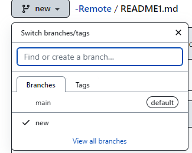

# Работа с удаленными репозиториями

1. Создать аккаунт на  GitHub
Вводим на сайте актуальную почту и придумываем пароль
2. Создать локальный репозиторий на компьютере
Создаем новую пустую папку и открываем ее в visual studio
3. Создать удаленный репозиторий git hub
4. Связать удаленный репозиторий с локальным

Добавить удаленный репозиторий к проекту, при помощи команды 
```
git remote add <имя для репозитория> <url адрес репозитория в сети>
```


# Работа  с чужим репозиторием и **pull request**
 1. В своём аккаунте на GitHub создать копию нужного репозитория 
 с помощью кнопки **"Fork"**.
---
2. Клонировать копию репозитория на локальный компьютер.
Чтобы клонировать копию репозитория, нужно ввести в терминале команду **git clone <ссылка на копию репозитория из github>**

---
3. Создать новую ветку в локальном репозитории.
Работу с удаленным репозиторием рекомендуется проводить в отдельной ветке. Для ее создания используем команду **git branch имя ветки**
---
4. Добавить файл в новую ветку.
---
5. Зафиксировать изменения (коммиты) в локальном репозитории.
---
6. Отправить изменения на GitHub.
Чтобы отправить изменения, используем команду *git push origin <название ветки>*
- В удаленном репозитории также должна появиться новая ветка

---
7. На сайте GitHub выполнить **Pull request**.
Для этого на странице GihHub нажимаетм кнопку pull request => new pull request. Далее выбираем нужную ветку и нажимаем на кнопку *create pull request*
---

